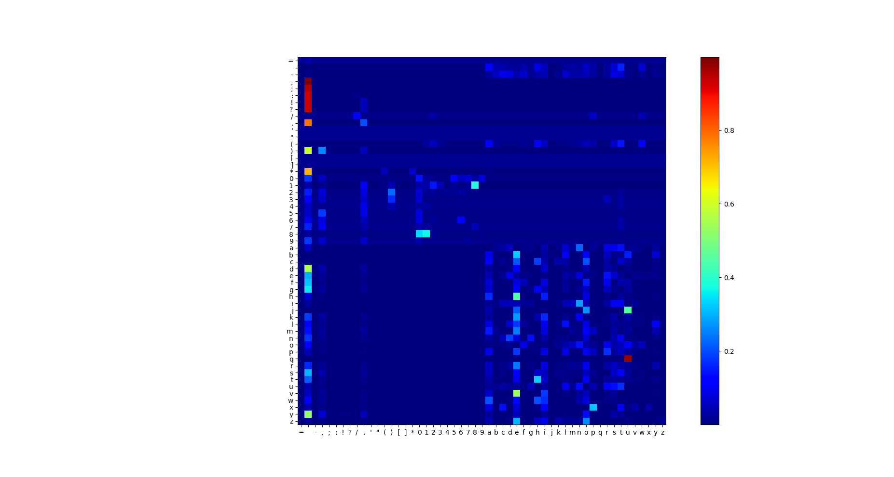

## Decrypting Messages with MCMC

Simple code to test MCMC for decrypting messages using Metropolis-Hastings sampler

##### Unigram probabilities:

| = |  | - | , | ; | : | ! | ? | / | . | ' | " | ( | ) | [ | ] | * | 0 | 1 | 2 | 3 | 4 | 5 | 6 | 7 | 8 | 9 | a | b | c | d | e | f | g | h | i | j | k | l | m | n | o | p | q | r | s | t | u | v | w | x | y | z |
| :---: | :---: | :---: | :---: | :---: | :---: | :---: | :---: | :---: | :---: | :---: | :---: | :---: | :---: | :---: | :---: | :---: | :---: | :---: | :---: | :---: | :---: | :---: | :---: | :---: | :---: | :---: | :---: | :---: | :---: | :---: | :---: | :---: | :---: | :---: | :---: | :---: | :---: | :---: | :---: | :---: | :---: | :---: | :---: | :---: | :---: | :---: | :---: | :---: | :---: | :---: | :---: | :---: |
| 0.000001 | 0.164806 | 0.000587 | 0.012784 | 0.000367 | 0.000325 | 0.001258 | 0.001005 | 0.000009 | 0.009894 | 0.000000 | 0.000000 | 0.000215 | 0.000215 | 0.000000 | 0.000000 | 0.000096 | 0.000058 | 0.000126 | 0.000047 | 0.000019 | 0.000007 | 0.000017 | 0.000018 | 0.000013 | 0.000062 | 0.000012 | 0.064964 | 0.011106 | 0.019747 | 0.037910 | 0.100489 | 0.017594 | 0.016448 | 0.053650 | 0.055202 | 0.000825 | 0.006548 | 0.030934 | 0.019756 | 0.059025 | 0.060915 | 0.014592 | 0.000747 | 0.047567 | 0.052203 | 0.072558 | 0.020638 | 0.008680 | 0.018974 | 0.001405 | 0.014817 | 0.000765 |

##### Bigram probabilites:

##### Sample iterations: 

[Reported iterations](reported_iterations.txt)

